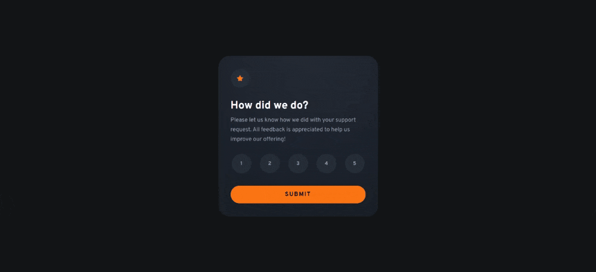

# Interactive Rating Component

<!-- ### Links -->
<!-- - [Solution]() -->
- [View Website](https://pedrowfilho.github.io/interactive-rating-component/) 🖱️

## Visão Geral

### Desafio

Este é um [desafio do Frontend Mentor](https://www.frontendmentor.io/challenges/interactive-rating-component-koxpeBUmI) para praticar o manuseio de interações do usuário e a atualização do DOM..

### Habilidades/Técnicas

- HTML
- CSS
- JavaScript
- Flexbox
- Responsividade
- Git

## Autor

Pedro Wagner - Front End Developer

